# Task API — W3 A2: Connecting CRUD Operations to SQLite Database


A RESTful **Task Management API** built with **FastAPI** and **SQLite** that demonstrates how to migrate from an in-memory CRUD application to persistent database storage while preserving the API interface.

This project is part of **Week 3 Assignment 2**, where the primary objective is to connect CRUD operations to a relational database without changing the existing API endpoints.

---

# Table of Contents

- [Overview](#overview)
- [Features](#features)
- [Technology Stack](#technology-stack)
- [Why SQLite?](#why-sqlite)
- [Project Structure](#project-structure)
- [Getting Started](#getting-started)
- [Database Initialization](#database-initialization)
- [Persistence Demonstration](#persistence-demonstration)
- [API Endpoints](#api-endpoints)
- [Example API Requests](#example-api-requests)
- [SQL Queries Used](#sql-queries-used)
- [Exploring the Database](#exploring-the-database)
- [Migration from A1 to A2](#migration-from-a1-to-a2)
- [AI vs Human Implementation](#ai-vs-human-implementation)
- [Git Commit History](#git-commit-history)
- [Learning Outcomes](#learning-outcomes)
- [Conclusion](#conclusion)

---

# System Architecture

<p align="center">
  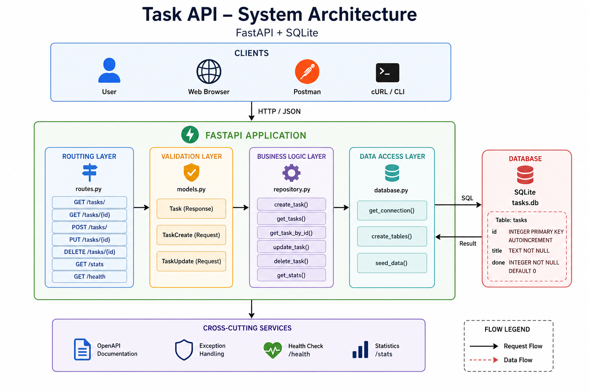
</p>

<p align="center">
<i>Figure 1. High-level architecture of the FastAPI Task API application.</i>
</p>

# Overview

The original Week 1 assignment stored tasks inside a Python list.

While this approach was useful for understanding CRUD operations, all data disappeared whenever the application restarted.

This assignment replaces the in-memory list with a SQLite database while keeping the REST API exactly the same.

As a result:

- Clients continue using the same endpoints.
- Existing tests continue to pass.
- Data now persists across server restarts.

This demonstrates one of the most important software engineering principles:

> **Storage is an implementation detail. Clients interact with the API—not the database.**

---

# Features

- RESTful CRUD API
- SQLite persistent storage
- Automatic database creation
- Automatic table creation
- Automatic seeding (first run only)
- Parameterized SQL queries
- SQL Injection protection
- Swagger API documentation
- Health check endpoint
- Statistics endpoint
- Modular project architecture

---
## 🏗️ System Architecture

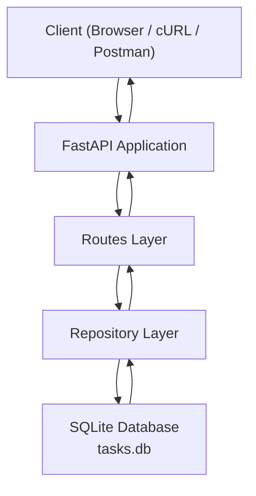

# Technology Stack

| Technology | Purpose |
|------------|---------|
| Python | Programming Language |
| FastAPI | REST API Framework |
| SQLite | Database |
| sqlite3 | Python Database Driver |
| Pydantic | Data Validation |
| Uvicorn | ASGI Server |

---

# Why SQLite?

SQLite is a lightweight relational database engine that stores an entire database inside a single file.

Unlike PostgreSQL or MySQL, SQLite requires:

- No database server
- No configuration
- No Docker container
- No authentication
- No additional installation

Benefits include:

- Zero setup
- Persistent storage
- Built into Python
- Portable single-file database
- Ideal for learning projects

For large production applications with many concurrent users, PostgreSQL would generally be preferred. However, SQLite is an excellent choice for small applications, prototypes, and educational projects.

---

# Project Structure

```text
task-api-a2/
│
├── main.py
├── requirements.txt
├── .gitignore
│
├── app/
│   ├── __init__.py
│   ├── database.py
│   ├── models.py
│   ├── repository.py
│   └── routes.py
│
├── ai-version/
│   ├── main.py
│   └── PROMPT.md
│
└── tasks.db
```

### Folder Description

| File | Purpose |
|------|----------|
| main.py | FastAPI application |
| database.py | SQLite connection and initialization |
| repository.py | SQL queries |
| routes.py | API endpoints |
| models.py | Pydantic schemas |
| tasks.db | SQLite database |

---

# Screenshots

This repository includes the following screenshot files from the `assets` folder:

- `assets/1_localhost_docs.png`
- `assets/2_get.png`
- `assets/3_post.png`
- `assets/4_put_tasks_id.png`
- `assets/5_delete_task.png`
- `assets/6_api_info.png`
- `assets/7_api_health.png`
- `assets/8_api_statistics.png`
- `assets/9_api_validation_schemas.png`
- `assets/architecture.png`
- `assets/VSCode Interface.png`

<p align="center">
  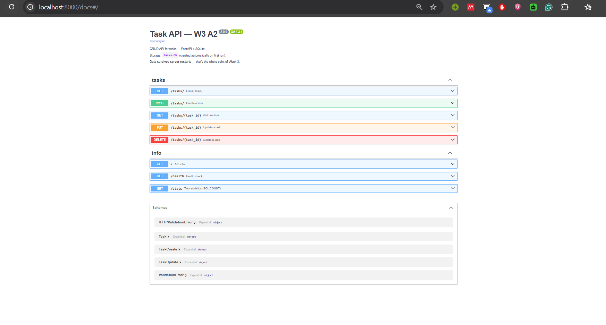
  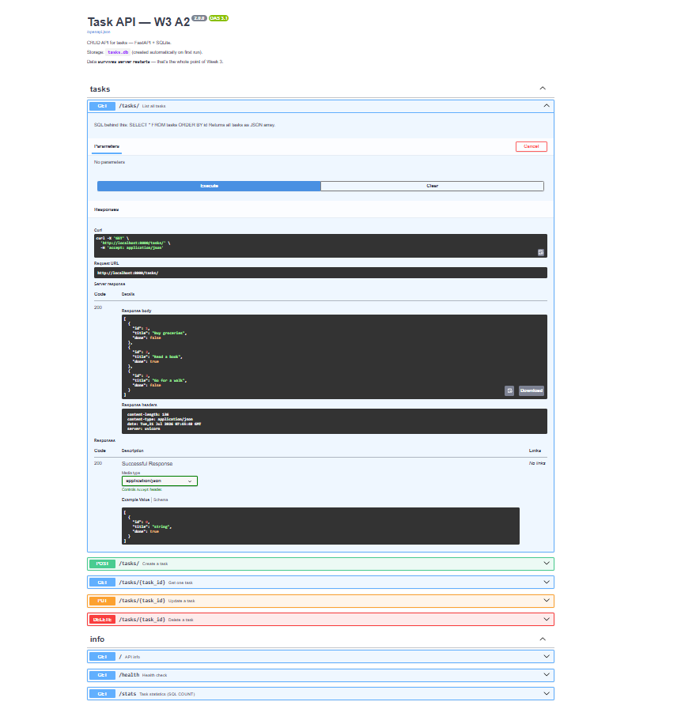
  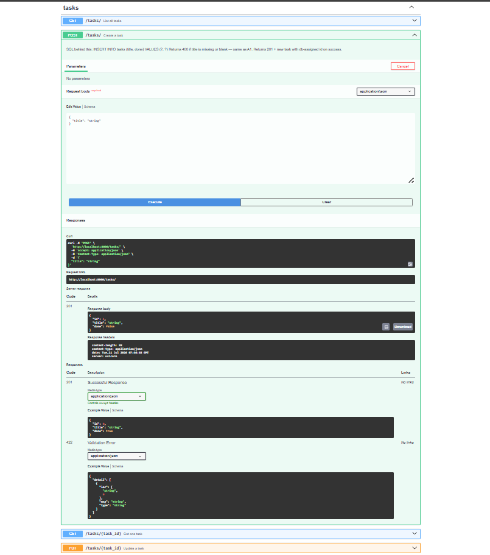
  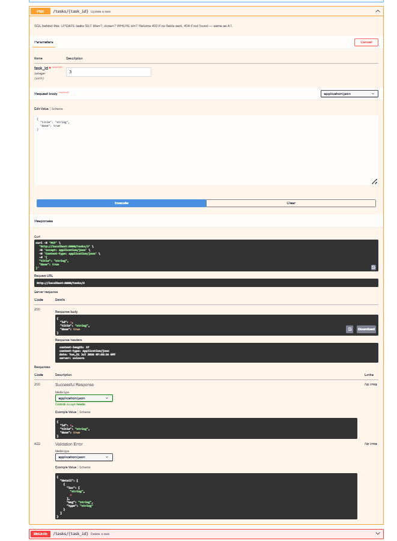
  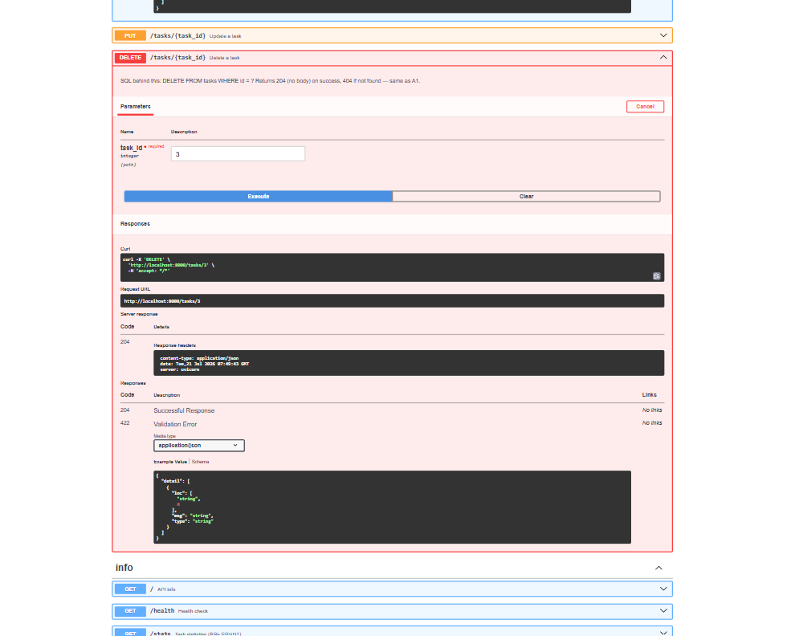
  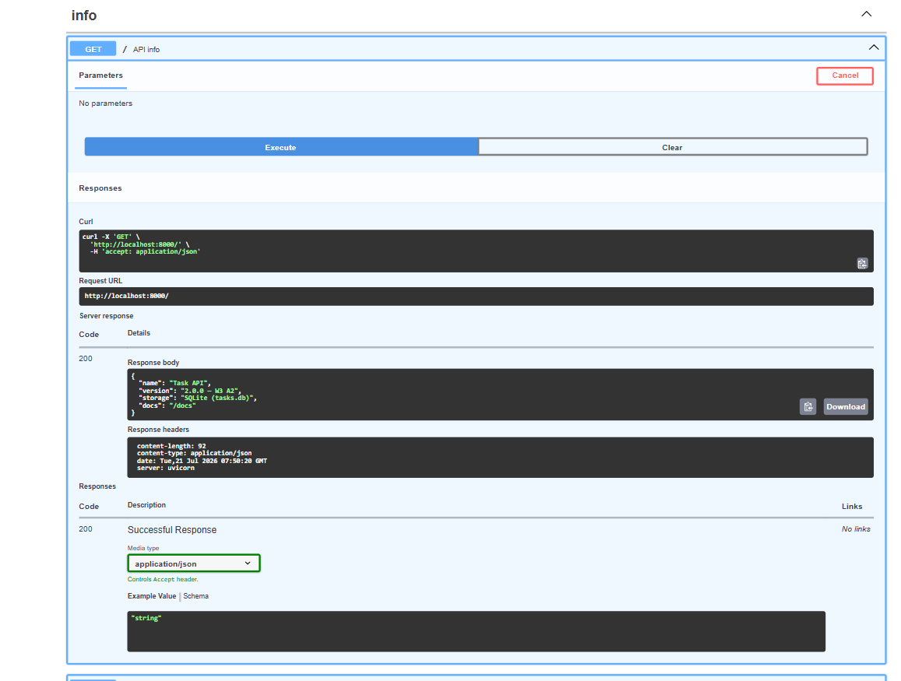
  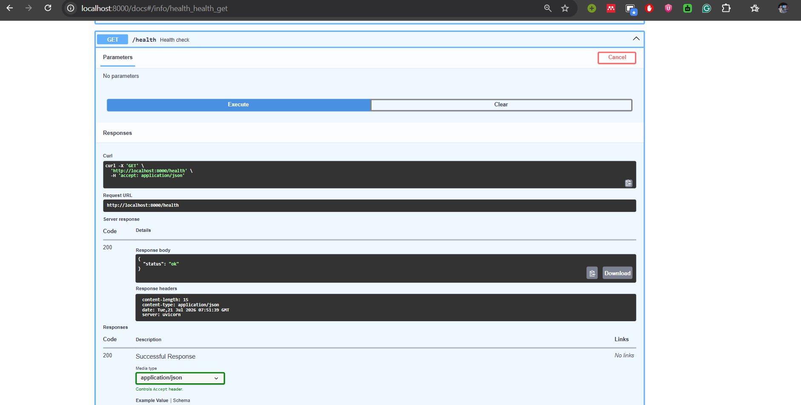
  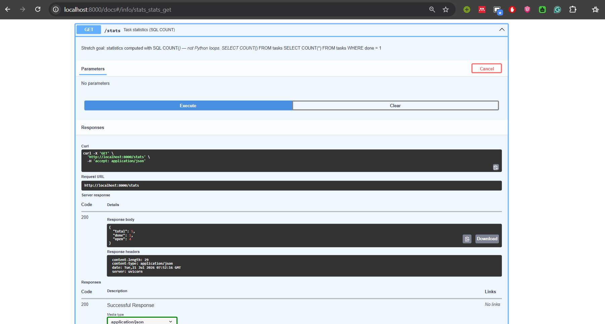
  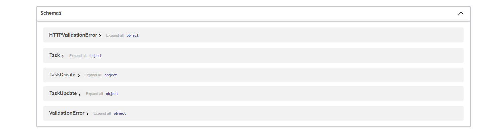
  
  
</p>

---

# Getting Started

## Clone the Repository

```bash
git clone https://github.com/yourusername/task-api-a2.git
cd task-api-a2
```

---

## Create Virtual Environment

### Windows

```bash
python -m venv venv
venv\Scripts\activate
```

### Linux / macOS

```bash
python3 -m venv venv
source venv/bin/activate
```

---

## Install Dependencies

```bash
pip install -r requirements.txt
```

---

## Run the Application

```bash
uvicorn main:app --reload
```

---

## Open the API

Swagger UI

```
http://localhost:8000/docs
```

ReDoc

```
http://localhost:8000/redoc
```

Health Check

```
http://localhost:8000/health
```

---

# Database Initialization

The first time the application starts:

- Creates `tasks.db`
- Creates the `tasks` table
- Seeds three example tasks

Console output:

```
Database seeded with 3 example tasks.
```

Subsequent launches:

```
Database already has N tasks — skipping seed.
```

---

# Persistence Demonstration

Start the application:

```bash
uvicorn main:app --reload
```

Create a task:

```bash
curl -X POST http://localhost:8000/tasks/ \
-H "Content-Type: application/json" \
-d '{"title":"Finish Assignment"}'
```

Response:

```json
{
    "id":4,
    "title":"Finish Assignment",
    "done":false
}
```

Stop the server.

Restart:

```bash
uvicorn main:app --reload
```

Retrieve the task:

```bash
curl http://localhost:8000/tasks/4
```

Response:

```json
{
    "id":4,
    "title":"Finish Assignment",
    "done":false
}
```

Unlike the previous assignment, the task remains available because it is stored in SQLite.

---

# API Endpoints

| Method | Endpoint | Description |
|---------|----------|-------------|
| GET | `/tasks/` | Retrieve all tasks |
| GET | `/tasks/{id}` | Retrieve a task |
| POST | `/tasks/` | Create task |
| PUT | `/tasks/{id}` | Update task |
| DELETE | `/tasks/{id}` | Delete task |
| GET | `/stats` | Task statistics |
| GET | `/health` | Health check |

---

# Example API Requests

## Retrieve All Tasks

```bash
curl http://localhost:8000/tasks/
```

---

## Retrieve One Task

```bash
curl http://localhost:8000/tasks/1
```

---

## Create Task

```bash
curl -X POST http://localhost:8000/tasks/ \
-H "Content-Type: application/json" \
-d '{"title":"Buy groceries"}'
```

---

## Update Task

```bash
curl -X PUT http://localhost:8000/tasks/1 \
-H "Content-Type: application/json" \
-d '{"done":true}'
```

---

## Delete Task

```bash
curl -X DELETE http://localhost:8000/tasks/1
```

---

## Statistics

```bash
curl http://localhost:8000/stats
```

---

# SQL Queries Used

Retrieve all tasks

```sql
SELECT * FROM tasks ORDER BY id;
```

Retrieve one task

```sql
SELECT * FROM tasks WHERE id = ?;
```

Insert

```sql
INSERT INTO tasks(title,done)
VALUES (?,?);
```

Update

```sql
UPDATE tasks
SET title=?, done=?
WHERE id=?;
```

Delete

```sql
DELETE FROM tasks
WHERE id=?;
```

Statistics

```sql
SELECT COUNT(*) FROM tasks;

SELECT COUNT(*)
FROM tasks
WHERE done=1;
```

Every SQL statement uses parameterized placeholders (`?`) to safely bind user input and prevent SQL injection attacks.

---

# Exploring the Database

Open **tasks.db** using **DB Browser for SQLite**.

Useful queries:

```sql
SELECT * FROM tasks;
```

```sql
SELECT * FROM tasks
WHERE done=1;
```

```sql
SELECT COUNT(*)
FROM tasks;
```

```sql
UPDATE tasks
SET done=1;
```

```sql
DELETE FROM tasks
WHERE done=1;
```

Since both the application and DB Browser access the same database file, any modifications become immediately visible through the API.

---

# Migration from A1 to A2

| Component | A1 | A2 |
|------------|-------------|-------------|
| Storage | Python List | SQLite |
| Persistence | No | Yes |
| IDs | Manual Counter | AUTOINCREMENT |
| Reads | List Iteration | SQL SELECT |
| Writes | append() | INSERT |
| Updates | List Modification | UPDATE |
| Deletes | List Removal | DELETE |
| API Routes | Same | Same |

The API interface remains unchanged.

Only the storage layer has been replaced.

---

# AI vs Human Implementation

The `ai-version` folder contains an AI-generated implementation created using the following prompt.

```text
I have a FastAPI CRUD task API in Python.

Migrate storage to SQLite using sqlite3.

Create tasks.db automatically.

Seed three tasks only if empty.

Use parameterized SQL queries.

Keep all endpoints identical.

Use AUTOINCREMENT.

Prevent SQL Injection.
```

## Comparison

### Human Version

- Modular architecture
- Separate repository layer
- Better maintainability
- Easier scalability

### AI Version

- Single file implementation
- Correct SQL logic
- Correct parameterized queries
- Correct AUTOINCREMENT usage

### Lesson Learned

The AI generated `/tasks` while my implementation used `/tasks/`.

Although both work, this demonstrates that precise specifications matter.

Small omissions in requirements can lead to different implementations.

---

# Git Commit History

```
Stage 0: Initialize SQLite

Stage 1: Read Operations

Stage 2: Insert Operations

Stage 3: Update/Delete

Stage 4: SQLite Exploration

Stage 5: Documentation

Stage 6: AI Comparison
```

---

# Learning Outcomes

This project demonstrates:

- FastAPI fundamentals
- REST API design
- SQLite database integration
- SQL CRUD operations
- Parameterized SQL queries
- SQL Injection prevention
- Repository pattern
- Layered backend architecture
- API documentation
- Database persistence
- AI-assisted software development evaluation

---

# Conclusion

This assignment successfully migrated a FastAPI CRUD application from volatile in-memory storage to persistent SQLite storage while preserving the REST API interface.

All existing endpoints continue to function without modification, proving that clients interact solely with the API rather than the underlying storage mechanism.

By separating the storage layer from the application logic, the project follows a fundamental software engineering principle that improves maintainability, scalability, and flexibility.

The result is a clean, modular, and production-inspired backend architecture suitable for learning modern API development with FastAPI and relational databases.